#  Alerts 

### 📌 Accessing Alerts and Contact Points : [Video](../static/img/alert-overview.mp4)👀

### ⭐ Creating Alert Rules ⭐

1. **Define Alert Rule and Query:**
   - Enter the details for your alert rule and the corresponding query.

      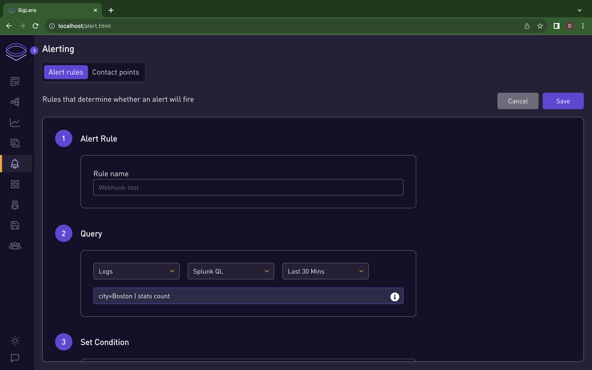

2. **Set Conditions and Contact Points:**
   - Specify the conditions for triggering the alert.

      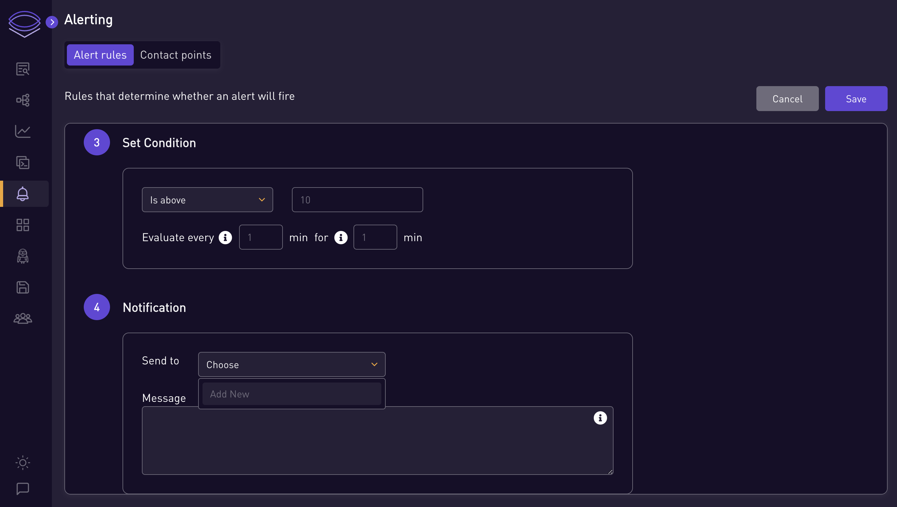

   - Select an existing contact point for notifications or create a new one if necessary.

      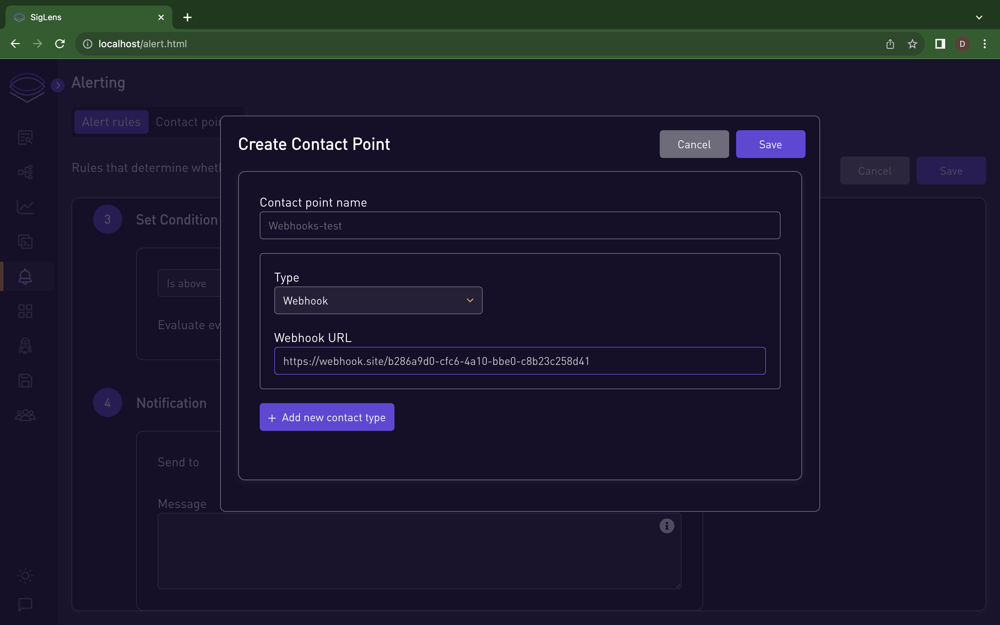

   - Write a message to send when the alert is triggered. You can customize the message using pre-defined template variables.

      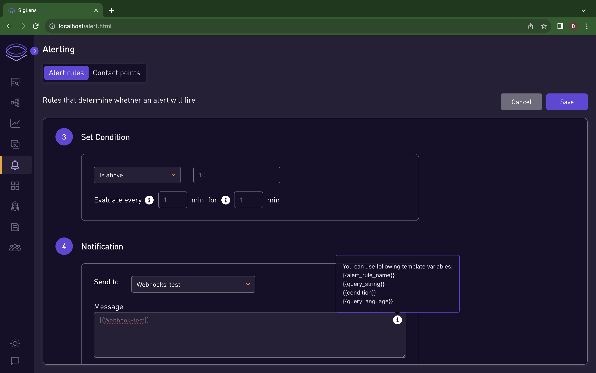

3. **Custom Labels (Optional):**
   - Add a custom label to your notification for easy identification.

      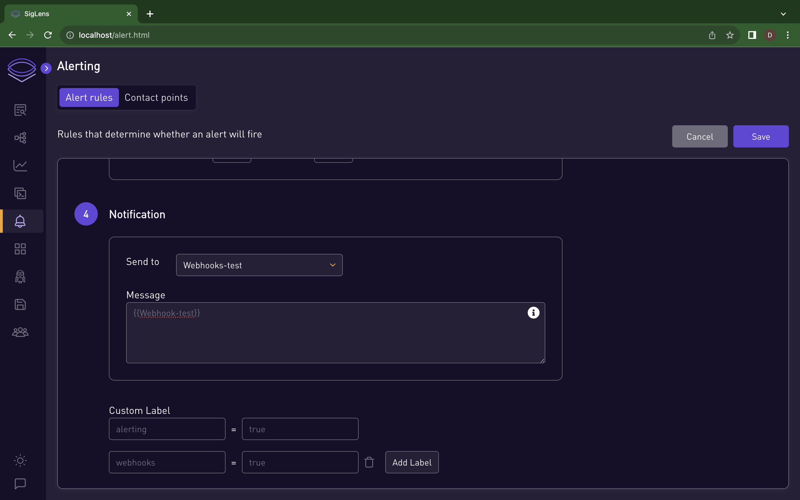

4. **Save and Verify:**
   - Save your alert rule. If the condition for alert rule is satisfied, the alert status will be set to 'firing'.

      

5. **Notification Confirmation:**
   - For Webhook notifications, confirm message received on the webhook site.

      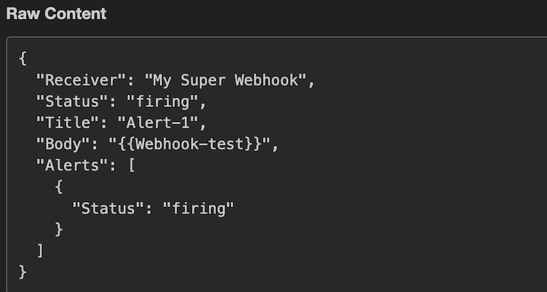

   - To receive Slack notifications, you need to provide channel id and slack token. To get channel id and slack token you can refer this documentation -> https://api.slack.com/tutorials/tracks/getting-a-token

      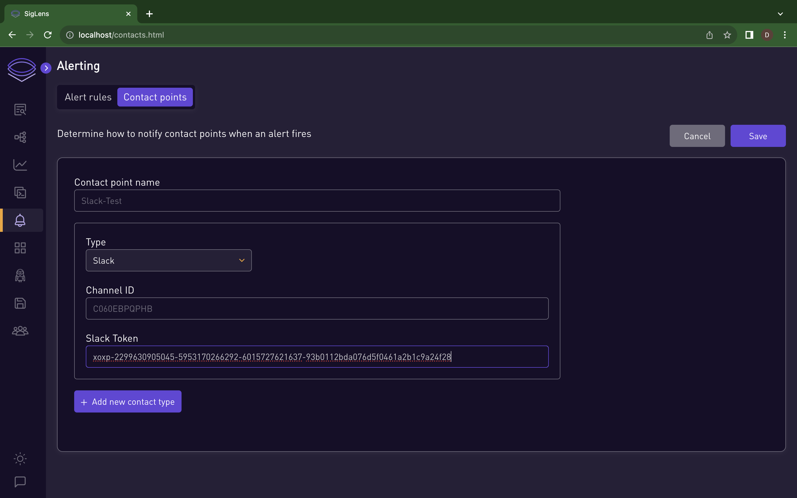

   - Check the designated Slack channel for notification.

      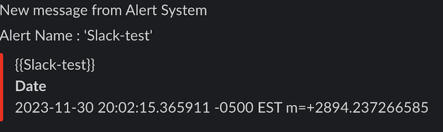

### ✏️ Editing and Deleting

1. **Editing Alert Rules:**
   - To edit an alert rule, click on alert rule name or press the edit button.

      

      

   - Make changes and save them.

      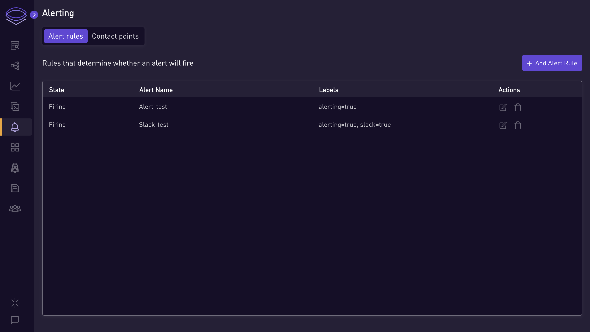

2. **Deleting Alert Rules:**
   - To delete an alert rule, press delete button for the alert to be deleted.

      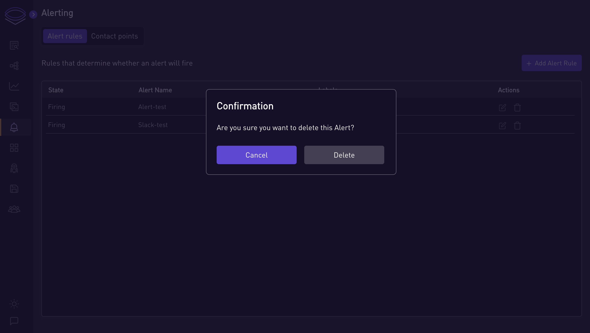

      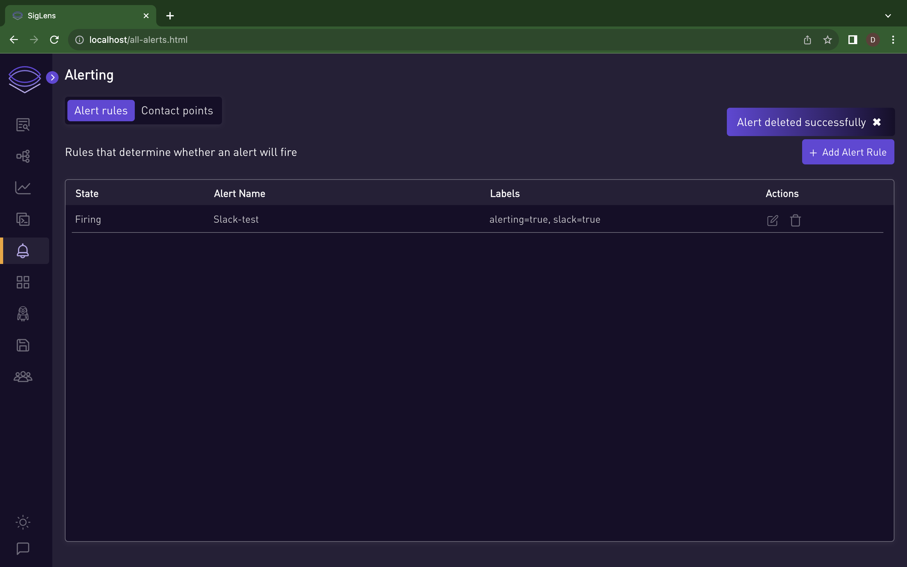

3. **Managing Contact Points:**
   -  To delete a contact point, ensure it is not linked to any active alert rules. You can not delete contact point associated with any of the alert rules.

      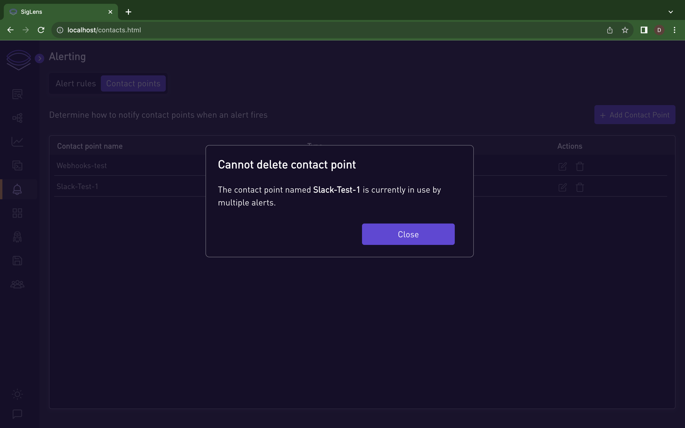

      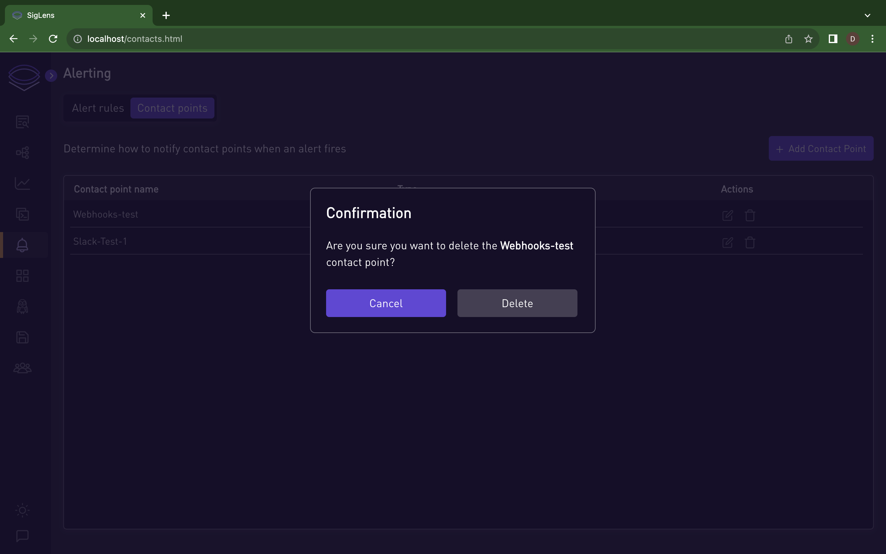

      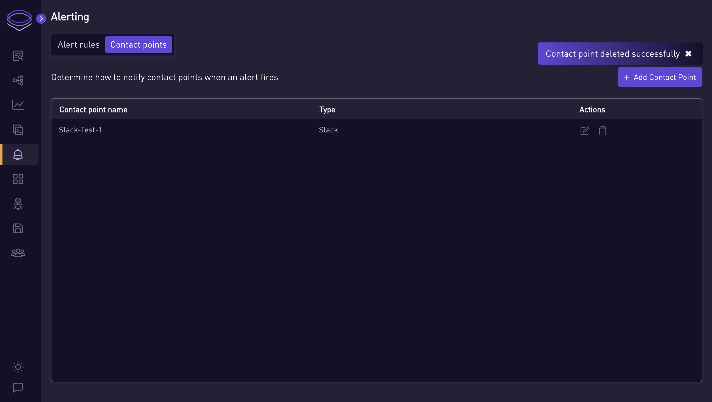