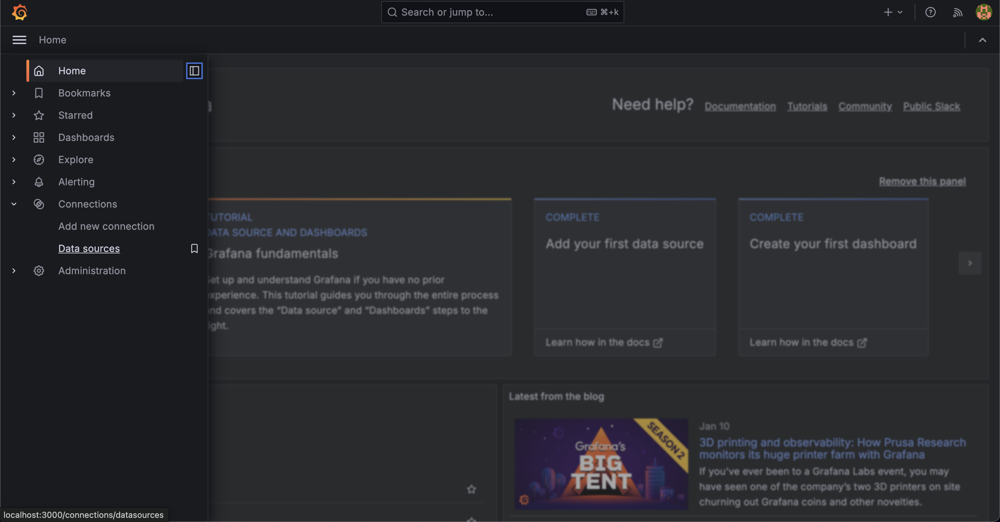

# Configure SigLens as a Prometheus Data Source in Grafana

This guide will walk you through the process of adding SigLens as a Prometheus data source in Grafana and set up dashboard using the data source.

## Before You Begin

Prerequisites:
- A running SigLens instance collecting metrics
- Access to your Grafana installation
- Prometheus metrics flowing into SigLens

## Add SigLens as a Data Source

### 1. Navigate to Data Sources

In the Grafana sidebar, navigate to **"Connections"** → **"Data sources"**



### 2. Add Prometheus Data Source

1. Click **"Add new data source"** button at the top of the page
2. In the search box, type **"Prometheus"** to filter the options
3. Select the **"Prometheus"**


### 3. Configure SigLens Connection

Enter the following configuration details:

1. Basic Configuration:
   - Name: `SigLens` (or your preferred name)
   - URL: `http://localhost:5122/promql` (adjust if using a different port)

2. Scroll down to the bottom and click **"Save & test"**


Upon successful connection, you'll see a green confirmation message.

## Create Dashboard

### 1. Set Up a New Dashboard

1. Click **"Building a Dashboard"** from the success message.
2. Click **"Add visualization"** in the empty dashboard
3. Choose your newly configured SigLens data source


### 2. Configure Your First Panel

1. In the Query editor, enter a test PromQL query
   ```promql
   up
   ```
2. Click **"Run queries"** to test


### 3. Save Your Dashboard

1. Save your dashboard by clicking the save icon in the top right
2. Add a meaningful dashboard title
2. Create additional panels as needed for your metrics


