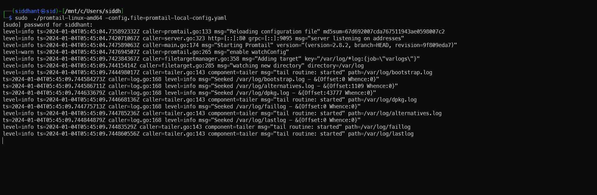

# Promtail

*Ingesting logs into Siglens using Promtail*

## 1. Install Promtail

- Download the correct binary for Promtail based on your operating system and unzip it in your local system. 

***The process below uses the MacOS binary files.***

    - If you are on a Linux host, download and use the correct Binary file from the [Loki releases](https://github.com/grafana/loki/releases/). The Linux binary for x86 architecture is called `promtail-linux-amd64.zip`.

-  Download and unzip the Promtail Binary
```
curl -O -L "https://github.com/grafana/loki/releases/download/v2.8.2/promtail-darwin-amd64.zip"

 unzip promtail-darwin-amd64.zip

```
## 2. Configure Promtail

- Create a promtail config file with the below [sample configuration](#sample-configuration-file). 
### Sample Configuration file
```
server:
  http_listen_port: 9080
  grpc_listen_port: 0

positions:
  filename: /tmp/positions.yaml

clients:
  - url: http://localhost:8081/loki/api/v1/push
scrape_configs:
- job_name: system
  static_configs:
  - targets:
      - localhost
    labels:
      job: varlogs
      __path__: /var/log/*log
```
## 3. Run Promtail

- Run the binary with the `promtail-local-config.yaml` configuration file.

```bash
./promtail-darwin-amd64 -config.file=promtail-local-config.yaml
```

You should see an output similar to the one below if the logs are successfully ingested. 



