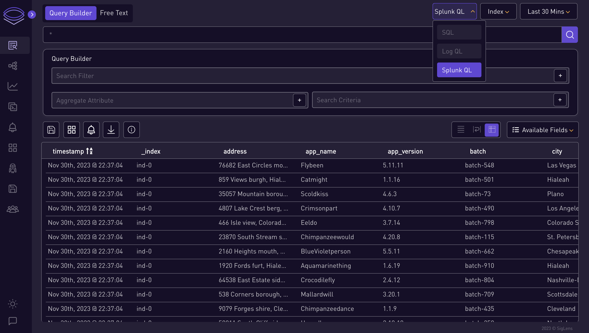
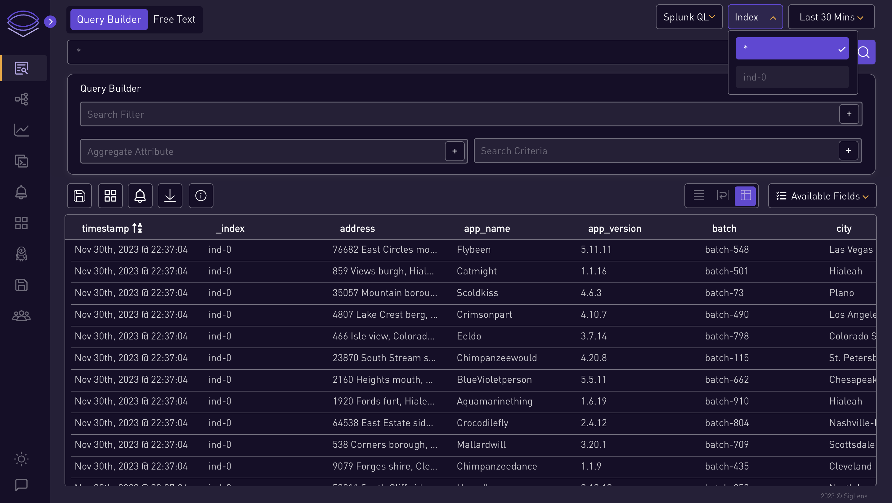
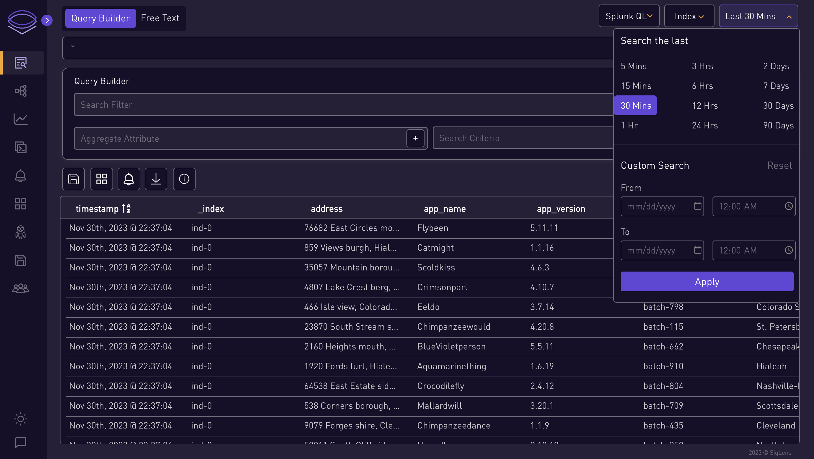
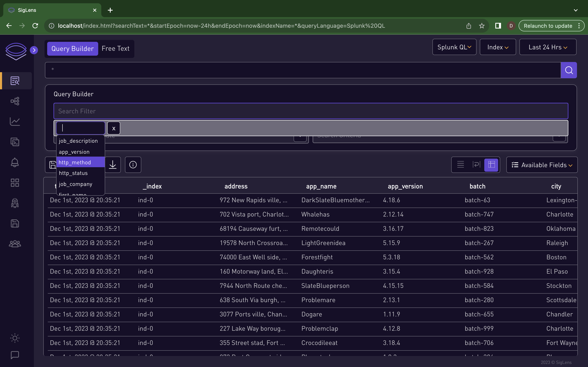
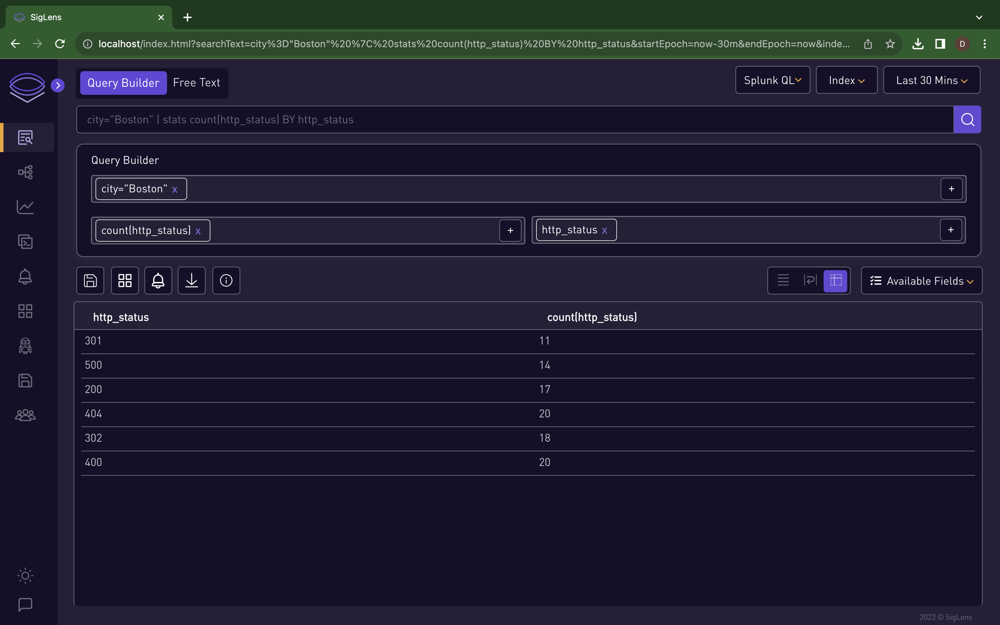

# Log Query Builder
import ReactPlayer from 'react-player'

### 🔍 Query Builder Interface Overview :

  <iframe
    src="https://www.youtube.com/embed/8q6dY6pqrSs?si=SqWj-A9nxnG_yXyV"
    title="YouTube video player"
    frameborder="0"
    allow="accelerometer; autoplay; clipboard-write; encrypted-media; gyroscope; picture-in-picture"
    allowfullscreen
  ></iframe>

1.  **Choose Query Type:**

    - Select the type of query you want to search:
     
      

2. **Select Index:**
    - Choose an index from the index dropdown.

      

3. **Set Time Range:**
    - Select the time range for the query.

      

4. **Select from the search dropdown**

      

      