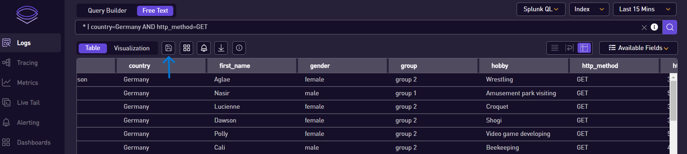
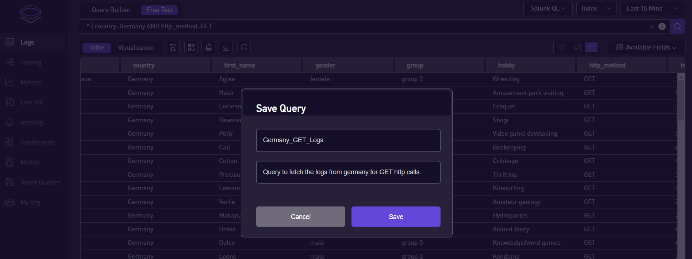
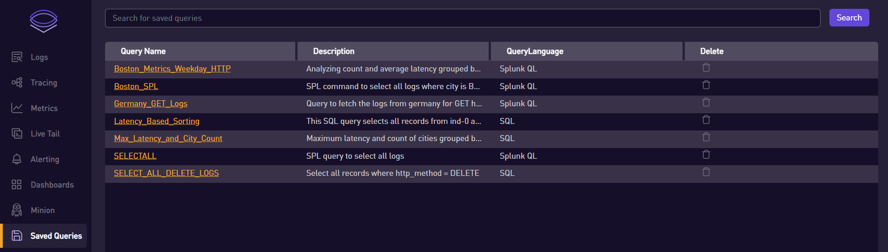

# Saved Queries

### 💾 How to Save a Query

1. **Enter the Query**: Start by entering your desired query into the search bar.

2. **Search**: After entering the query, hit the 'Search' button to execute the search.

3. **Save the Query**: Once the search is complete, click on the 'Save' button which is located below the search bar on the left side. A dialog box will appear.

4. **Enter Details**: In the dialog box, provide a title and description for the saved query, then click 'Save'.

### 📂 Accessing and Managing Saved Queries

1. **Navigate to Saved Queries Page**: The saved queries can be viewed on the 'Saved Queries' page. You can navigate to this page from the navigation bar.

2. **Apply a Saved Query**: To use a saved query, simply click on it from the 'Saved Queries' page. The query will be applied immediately.

3. **Delete a Saved Query**: If a saved query is no longer needed, it can be deleted. To delete a saved query, click on the delete option next to the query on the 'Saved Queries' page.

