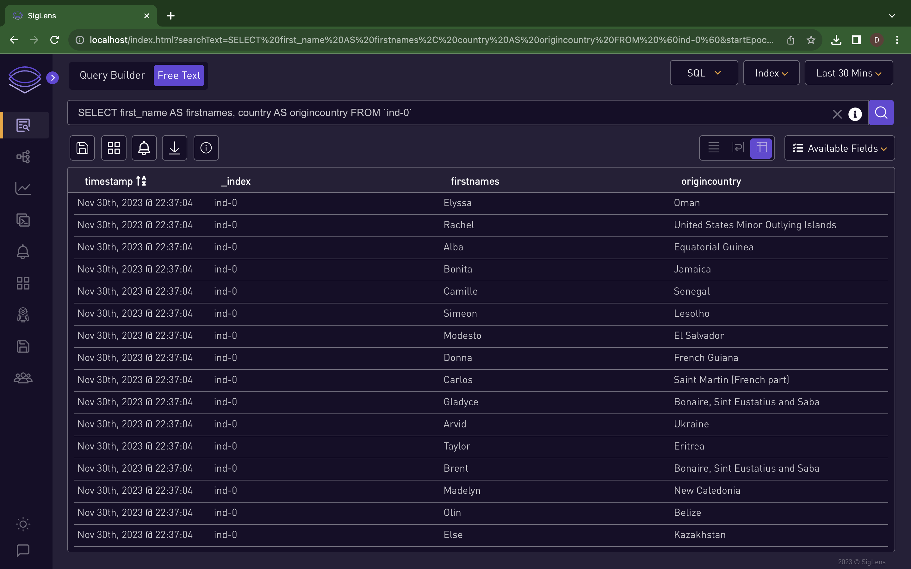
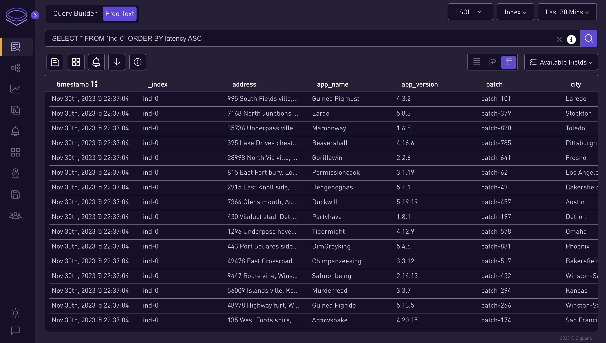
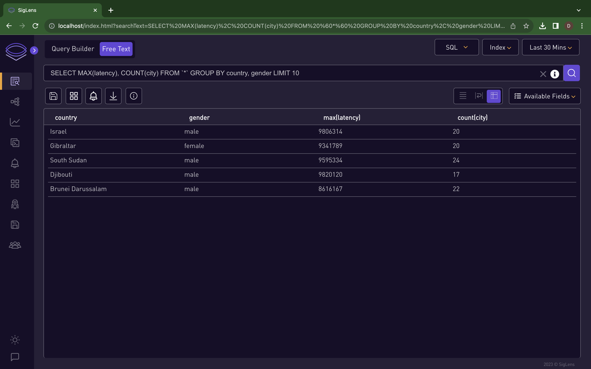
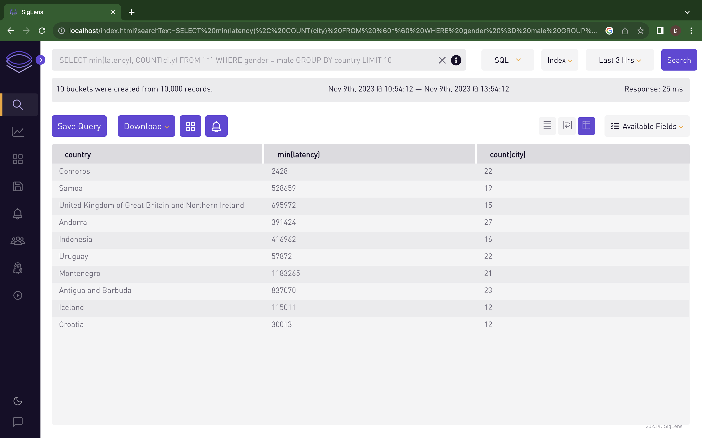
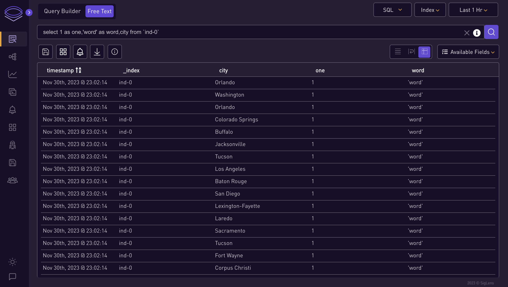

# Searching Logs

### 🔍 Log Search Interface Overview :[Video](../static/img/logs-search-video.mp4) 👀

### ⭐ Steps for Using the Logs Search ⭐

1. **Select or Enter Queries:**
   - You can either select a query from the info icon or enter your own.

      

2. **Choose Query Type:**
   - Select which type of query you want to search: SQL, Splunk QL, LogQL.
     
      

3. **Select Index:**
   - Choose an index from the index dropdown.

      

4. **Set Time Range:**
   - Select the time range for the query.

      


      ### ⭐ SQL Query Examples ⭐
      ```
      SELECT first_name AS firstnames, country AS origincountry FROM `ind-0`
      ```
      
      ```   
      SELECT * FROM `ind-0` ORDER BY latency ASC
      ```
      
      ```
      SELECT MAX(latency), COUNT(city) FROM `*` GROUP BY country, gender LIMIT 10
      ```
      
      ```
      SELECT min(latency), COUNT(city) FROM `*` WHERE gender = male GROUP BY country LIMIT 10
      ```
      
      ```
      select 1 as one,'word' as word,city from `ind-0`
      ```
      

      ### ⭐ Splunk QL Query Examples ⭐
      ```
      city=Boston | stats count AS Count BY weekday | where Count / 2 > 6 OR weekday = "Saturday"
      ```
      
      ```
      http_method=POST | regex city="^[a-zA-Z]+\s[a-zA-Z]+$" | fields city
      ```
      
      ```
      city=Boston | stats count AS Count BY state | eval myField=state . " start:" . rtrim(state, "nd")
      ```
      
      ```
      city=Boston | stats count AS Count BY state | eval myField=if(in(state, "Mary" . "land", "Hawaii", 99 + 1), state, "Error")
      ```
      
      ```
      city=Columbus | stats count AS Count BY http_status | eval sqrt=sqrt(http_status + 200)
      ```
      

      ### ⭐ Log QL Query Examples ⭐
      ```
      {gender="female",city="Fresno"} != "batch-212"
      ```
      
      ```
      {gender="female"} | json
      ```
      
      ```
      {gender="female"} | logfmt
      ```
      
      ```
      {gender="female",city="Fresno"} | json city_life="city", single_gender="gender[0]"
      ```
      
      ```
      {gender="female",city="Fresno"} | logfmt city_life="city", single_gender="gender", host
      ```
      
