# Searching Logs
import ReactPlayer from 'react-player'

### 🔍 Log Search Interface Overview :
<div class="responsive-iframe">
  <iframe
    src="https://www.youtube.com/embed/ROa2owJPOJo?si=IMJJuZmvDxEwCAov"
    title="YouTube video player"
    frameborder="0"
    allow="accelerometer; autoplay; clipboard-write; encrypted-media; gyroscope; picture-in-picture"
    allowfullscreen
  ></iframe>
</div>

### Supported Splunk - SPL Commands

Our system supports the following SPL (Search Processing Language) commands:

1. **Search**: Searches for events that match the specified criteria. [Read more](https://docs.splunk.com/Documentation/SplunkCloud/9.1.2312/SearchReference/Search).
2. **Regex**: Matches events with a regular expression. [Read more](https://docs.splunk.com/Documentation/SplunkCloud/9.1.2312/SearchReference/Regex).
3. **Dedup**: Removes duplicate events that share common values. [Read more](https://docs.splunk.com/Documentation/SplunkCloud/9.1.2312/SearchReference/Dedup).
4. **Transaction**: Groups events that are related to the same transaction. [Read more](https://docs.splunk.com/Documentation/SplunkCloud/9.1.2312/SearchReference/Transaction).
5. **Stats**: Computes summary statistics for your events. [Read more](https://docs.splunk.com/Documentation/SplunkCloud/9.1.2312/SearchReference/Stats).
6. **Timechart**: Creates time-based charts from your events. [Read more](https://docs.splunk.com/Documentation/SplunkCloud/9.1.2312/SearchReference/Timechart).
7. **Eval**: Evaluates expressions and adds the result to your events. [Read more](https://docs.splunk.com/Documentation/SplunkCloud/9.1.2312/SearchReference/Eval).
8. **Rex**: Extracts fields using regular expression named groups. [Read more](https://docs.splunk.com/Documentation/SplunkCloud/9.1.2312/SearchReference/Rex).
9. **Sort**: Sorts events based on specified fields. [Read more](https://docs.splunk.com/Documentation/SplunkCloud/9.1.2312/SearchReference/Sort).
10. **Head**: Returns the first N events from your search results. [Read more](https://docs.splunk.com/Documentation/SplunkCloud/9.1.2312/SearchReference/Head).
11. **Fields**: Selects which fields to keep or remove from your events. [Read more](https://docs.splunk.com/Documentation/SplunkCloud/9.1.2312/SearchReference/Fields).
12. **Top**: Returns the most frequent values of a field. [Read more](https://docs.splunk.com/Documentation/SplunkCloud/9.1.2312/SearchReference/Top).
13. **Rare**: Returns the least frequent values of a field. [Read more](https://docs.splunk.com/Documentation/SplunkCloud/9.1.2312/SearchReference/Rare).
14. **Rename**: Renames fields in your events. [Read more](https://docs.splunk.com/Documentation/SplunkCloud/9.1.2312/SearchReference/Rename).
15. **Where**: Filters events based on a specified condition.  [Read more](https://docs.splunk.com/Documentation/SplunkCloud/9.1.2312/SearchReference/Where).
16. **Tail**: Returns the last N events from your search results. [Read more](https://docs.splunk.com/Documentation/SplunkCloud/9.1.2312/SearchReference/Tail).
17. **Makemv**: Converts a field with delimiters into a multi-value field. [Read more](https://docs.splunk.com/Documentation/SplunkCloud/9.1.2312/SearchReference/Makemv).
18. **Format**: Formats field values according to specified templates. [Read more](https://docs.splunk.com/Documentation/SplunkCloud/9.1.2312/SearchReference/Format).
19. **Streamstats**: Computes running statistics on your events. [Read more](https://docs.splunk.com/Documentation/SplunkCloud/9.1.2312/SearchReference/Streamstats).
20. **Bin**: Groups numeric values into bins or ranges. [Read more](https://docs.splunk.com/Documentation/SplunkCloud/9.1.2312/SearchReference/Bin).
21. **Fillnull**: Replaces null values with specified values. [Read more](https://docs.splunk.com/Documentation/SplunkCloud/9.1.2312/SearchReference/Fillnull).
22. **Mvexpand**: Expands multi-value fields into separate events. [Read more](https://docs.splunk.com/Documentation/SplunkCloud/9.1.2312/SearchReference/Mvexpand).
23. **Gentimes**: Generates events for specified time ranges. [Read more](https://docs.splunk.com/Documentation/SplunkCloud/9.1.2312/SearchReference/Gentimes).
24. **Inputlookup**: Retrieves data from lookup tables. [Read more](https://docs.splunk.com/Documentation/SplunkCloud/9.1.2312/SearchReference/Inputlookup).

For detailed usage and examples, please refer to the specific command documentation.


### ⭐ Steps for Using the Logs Search ⭐

1. **Select or Enter Queries:**
   - You can either select a query from the info icon or enter your own.

      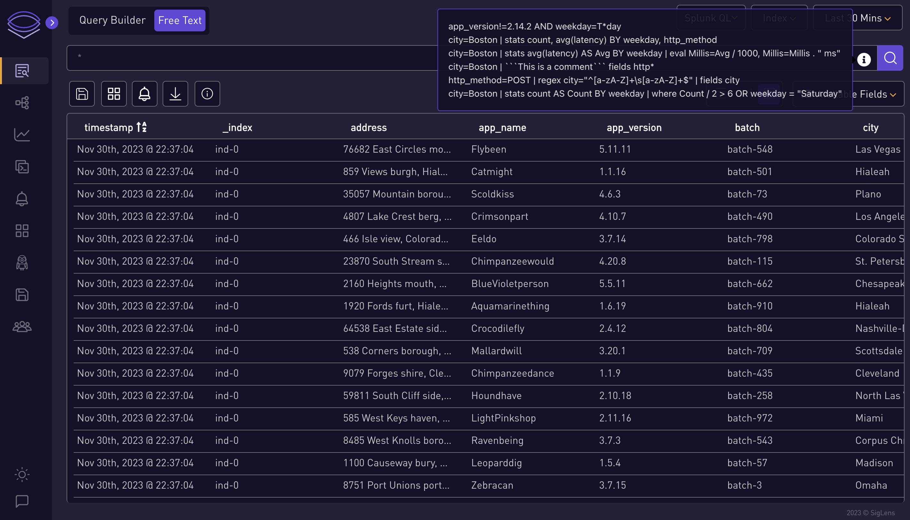

2. **Choose Query Type:**
   - Select which type of query you want to search: Splunk QL, LogQL.
     
      

3. **Select Index:**
   - Choose an index from the index dropdown.

      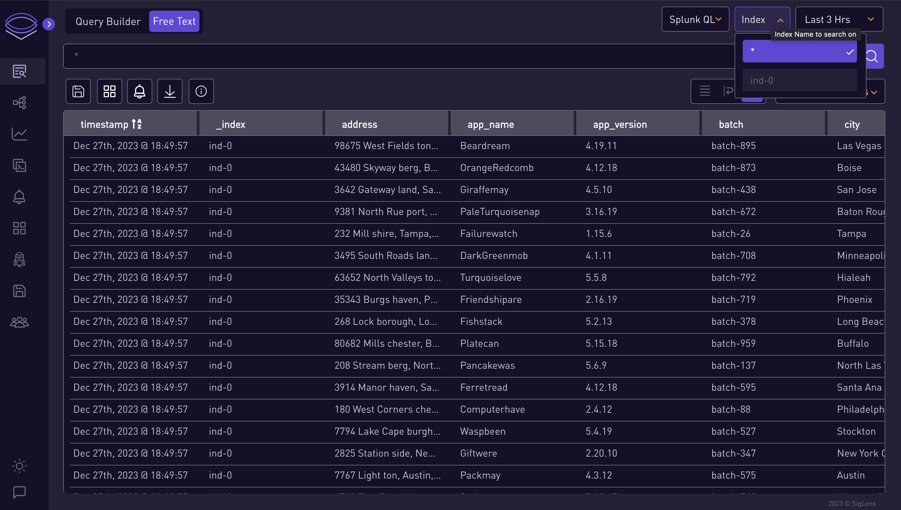

4. **Set Time Range:**
   - Select the time range for the query.

      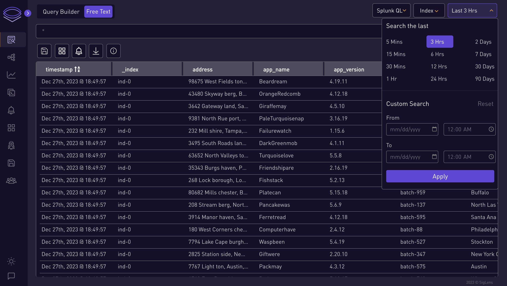

      ### ⭐ Splunk QL Query Examples ⭐
      ```
      city=Boston | stats count AS Count BY weekday | where Count / 2 > 6 OR weekday = "Saturday"
      ```
      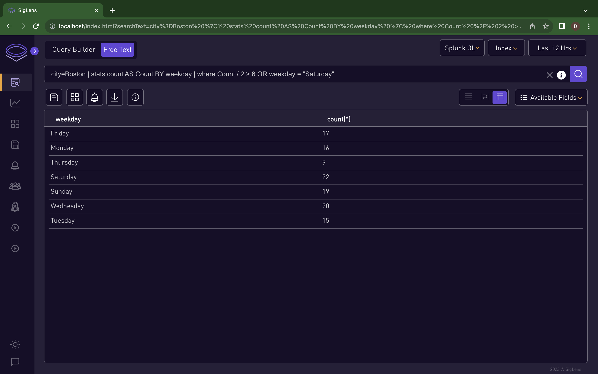
      ```
      http_method=POST | regex city="^[a-zA-Z]+\s[a-zA-Z]+$" | fields city
      ```
      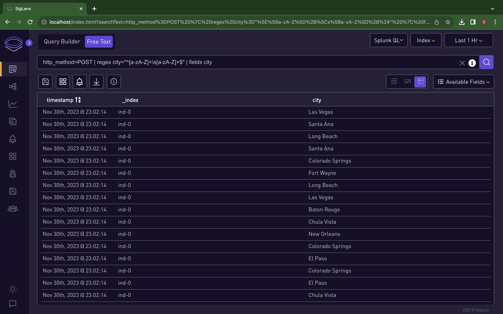
      ```
      city=Boston | stats count AS Count BY state | eval myField=state . " start:" . rtrim(state, "nd")
      ```
      
      ```
      city=Boston | stats count AS Count BY state | eval myField=if(in(state, "Mary" . "land", "Hawaii", 99 + 1), state, "Error")
      ```
      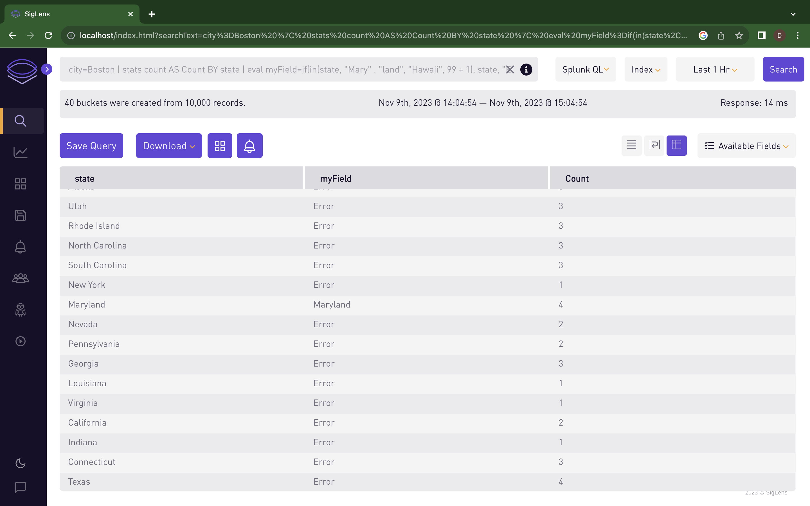
      ```
      city=Columbus | stats count AS Count BY http_status | eval sqrt=sqrt(http_status + 200)
      ```
      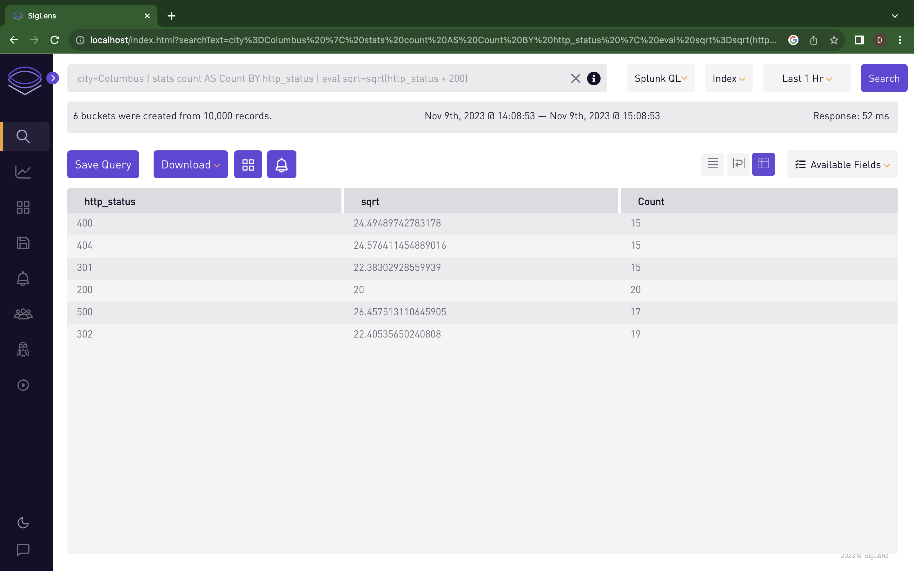

      ### ⭐ Log QL Query Examples ⭐
      ```
      {gender="female",city="Fresno"} != "batch-212"
      ```
      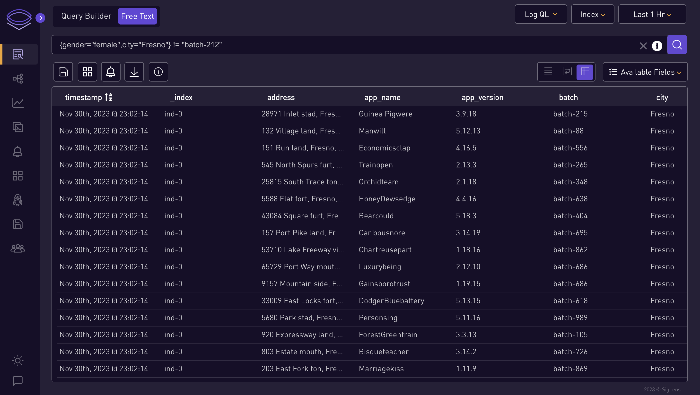
      ```
      {gender="female"} | json
      ```
      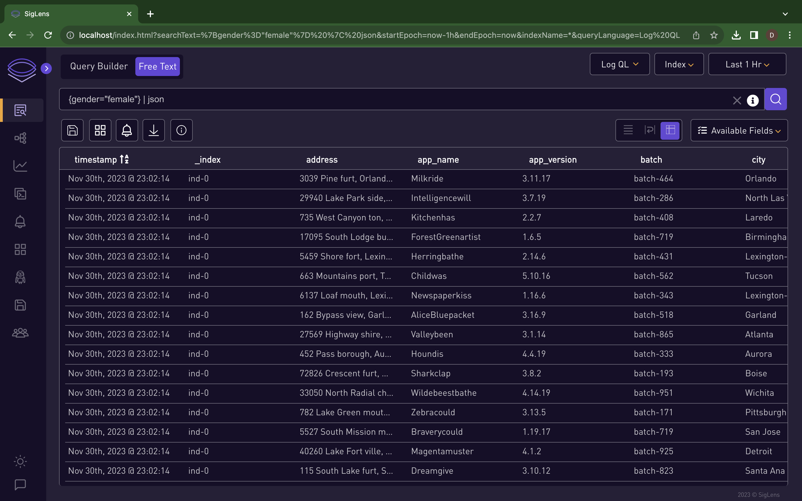
      ```
      {gender="female"} | logfmt
      ```
      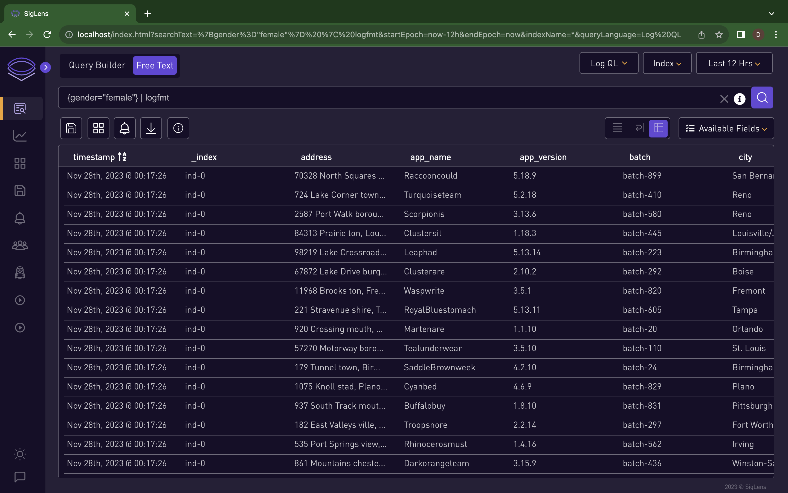
      ```
      {gender="female",city="Fresno"} | json city_life="city", single_gender="gender[0]"
      ```
      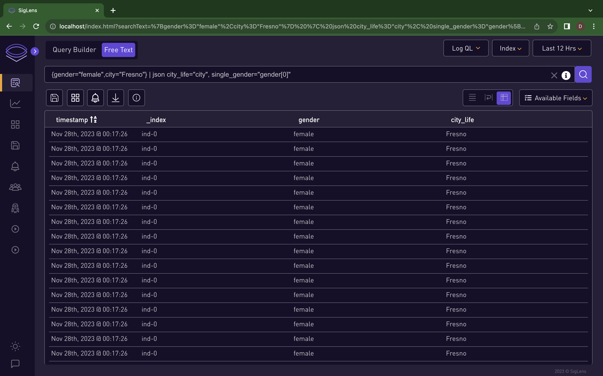
      ```
      {gender="female",city="Fresno"} | logfmt city_life="city", single_gender="gender", host
      ```
      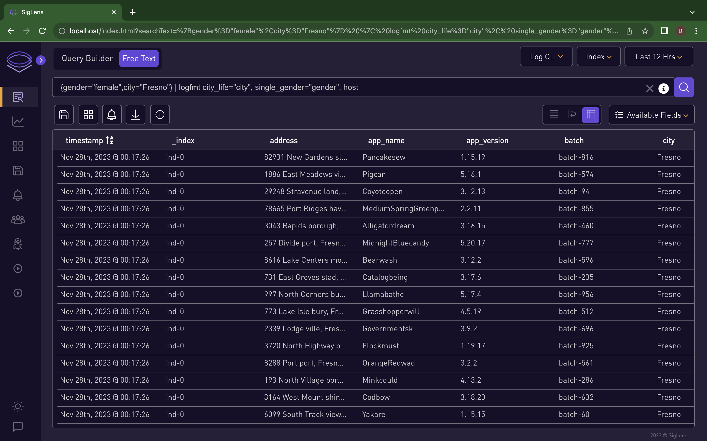
