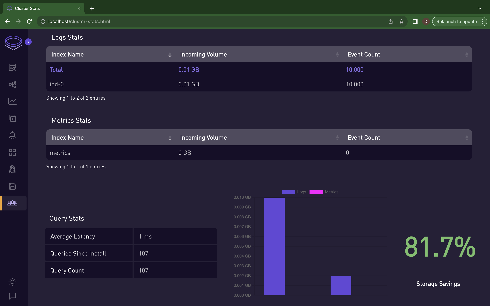

# Usage Stats

# Cluster Stats Dashboard 📊

Welcome to the Cluster Stats Dashboard. To view the cluster stats you have to ingest the data.

You can ingest test data: [Video](../static/img/test-data.mp4)

## ⭐ Features Overview ⭐

- **Real-Time Event Monitoring:** Track the event count and volume in real time. 
- **Log Statistics:** Get a detailed breakdown of logs by index name, incoming volume, and event count. 
- **Metrics Analysis:** Analyze metrics for system performance and efficiency. 
- **Query Statistics:** Monitor the performance of your queries with average latency and count.

##  Dashboard Sections 

### Incoming Event Count & Volume 🚀

- **Chart 1:** Displays the incoming event count over time, allowing you to monitor the flow of events into your system.

- **Chart 2:** Shows the incoming data volume, providing insight into the data throughput within the specified time frame.

    

### Logs, Metrics, Query Stats 📈

- **Table 1:** Presents a summary of logs, detailing the index names along with their respective incoming volume and event count.

- **Table 2:** Presents a summary of metrics, detailing the index names along with their respective incoming volume and event count.

- **Table 3:** Focuses on query performance, with statistics on average latency and total query count and queries since install

- **Storage Savings:** Highlights the storage savings achieved for cost-effective storage management.

    

